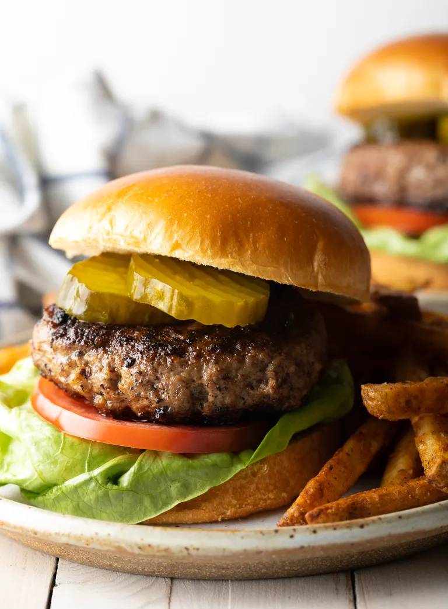

<html>
 <head> <i> Dishes to try! </i>
  </head>

 <a href="https://www.foodnetwork.com/grilling/grilling-central-burgers-and-hot-dogs/top-hot-dogs">Glizzy</a>
 
 A burger recipe worthy of a click? 

 
 <hr/ >
 
 <a href="https://barefeetinthekitchen.com/homemade-ice-cream-recipe/">Icecream</a>
  
 <hr/ >

 <a href="https://www.spendwithpennies.com/easy-homemade-lasagna/">Italy menu</a>
   
 <hr/ >
 
 <a href="https://www.tasteofhome.com/collection/classic-homemade-soup-recipes/">Soup</a>
   
 <hr/ >
      
 <a href="https://www.foodandwine.com/drinks/cocktail-recipes-2022">Drinks</a>
   

 
 </html>
